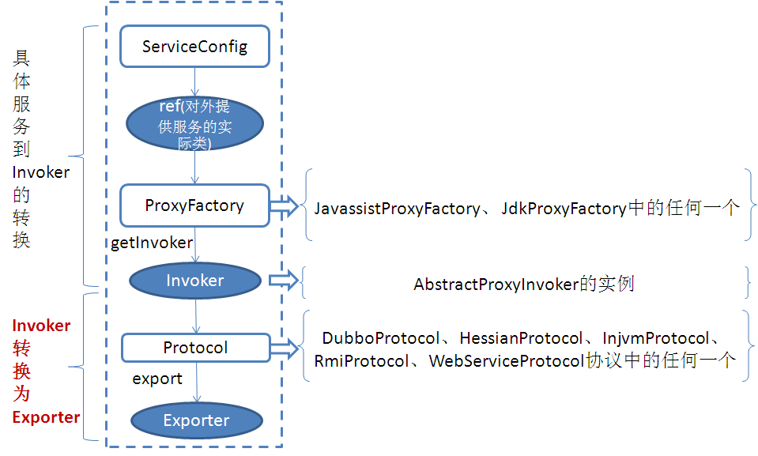
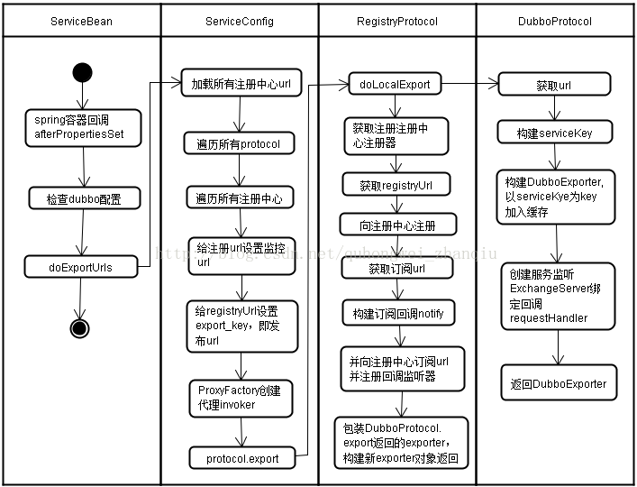

DUBBO服务提供者暴露逻辑源码学习
=================

# 1. 服务暴露流程简介

&nbsp;&nbsp;&nbsp;&nbsp;通过解析配置文件，将xml定义的Bean解析并实例化，（涉及重要的类：ServiceBean、RegistryConfig[注册中心配置]、ProtocolConfig[协议配置]、ApplicationConfig[应用配置]）,最终向注册中心注册服务提供方的过程。

# 2. 服务发布流程

