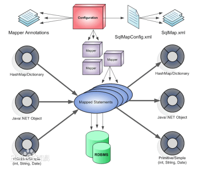
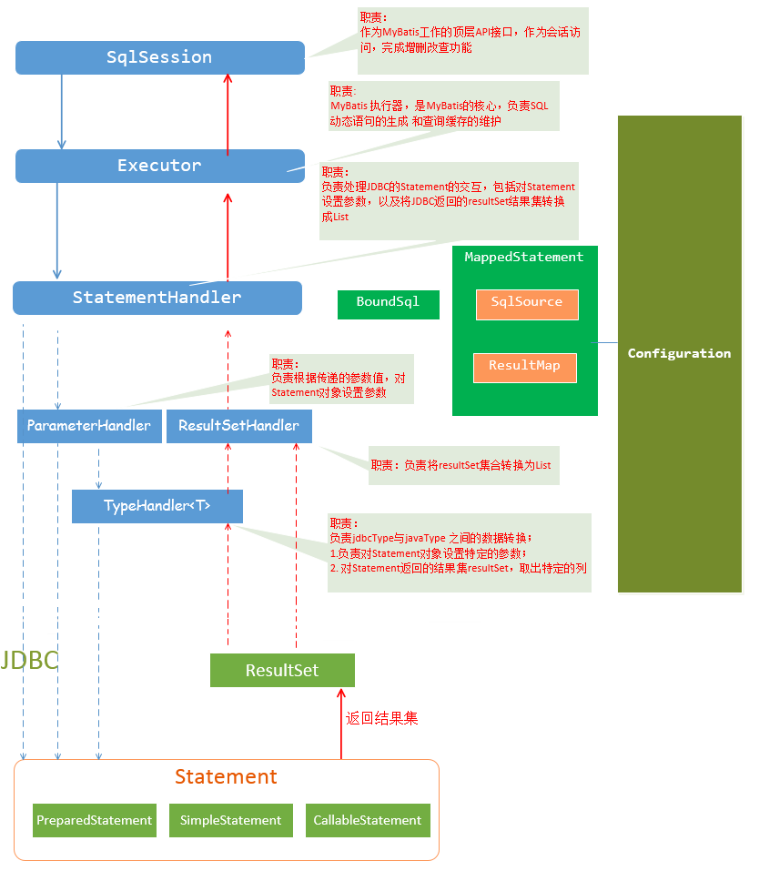

MyBatis源码学习
=================
&nbsp;&nbsp;&nbsp;&nbsp;MyBatis 是一款优秀的持久层框架，它支持定制化 SQL、存储过程以及高级映射。MyBatis 避免了几乎所有的 JDBC 代码和手动设置参数以及获取结果集。MyBatis 可以使用简单的 XML 或注解来配置和映射原生信息，将接口和 Java 的 POJOs(Plain Old Java Objects,普通的 Java对象)映射成数据库中的记录。

# 1. MyBatis组成部分

|组件|含义|
|--------|--------|
|SqlSession            |作为MyBatis工作的主要顶层API，表示和数据库交互的会话，完成必要数据库增删改查功能|
|Executor              |MyBatis执行器，是MyBatis 调度的核心，负责SQL语句的生成和查询缓存的维护|
|StatementHandler   |封装了JDBC Statement操作，负责对JDBC statement 的操作，如设置参数、将Statement结果集转换成List集合|
|ParameterHandler   |负责对用户传递的参数转换成JDBC Statement 所需要的参数|
|ResultSetHandler    |负责将JDBC返回的ResultSet结果集对象转换成List类型的集合|
|TypeHandler          |负责java数据类型和jdbc数据类型之间的映射和转换|
|MappedStatement   | MappedStatement维护了一条select|update|delete|insert节点的封装|
|SqlSource            |负责根据用户传递的parameterObject，动态地生成SQL语句，将信息封装到BoundSql对象中，并返回|
|BoundSql             |表示动态生成的SQL语句以及相应的参数信息|
|Configuration        |MyBatis所有的配置信息都维持在Configuration对象之中|

# 2. 数据库交互操作接口

&nbsp;&nbsp;&nbsp;&nbsp;数据库交互操作包括两种方式：1）使用传统MyBatis提供的API；2）使用Mapper接口操作。

# 2.1 使用传统MyBatis提供的API操作

&nbsp;&nbsp;&nbsp;&nbsp;使用SqlSession对象完成和数据库交互，请求时候根据statement和参数来执行。面向对象方式推荐使用接口直接来调用，因此实际上对SQL操作使用第二种方式，Mapper接口来实现。
~~~txt
List<?>|int|void|Map<?,?> SqlSession.select|insert|update|delete|......(statement, [parameterObject])
~~~

# 2.2 使用Mapper接口操作

&nbsp;&nbsp;&nbsp;&nbsp;MyBatis加载配置后，会将配置文件每个Mapper节点抽象为Mapper接口，接口中申请的方法跟Mapper节点中<select|update|insert|delete>节点项对应，即<select|update|insert|delete>节点的ID值为Mapper接口中的方法名称。parameterType值表示方法对应的入参，resultMap值对应Mapper接口表示返回值类型或者返回结果集的类型。
~~~java
public interface RuleMapper {

    Rule selectOne(long id);
}
~~~
~~~xml
<?xml version="1.0" encoding="UTF-8" ?>
<!DOCTYPE mapper
        PUBLIC "-//mybatis.org//DTD Mapper 3.0//EN"
        "http://mybatis.org/dtd/mybatis-3-mapper.dtd">
<mapper namespace="com.wx.somecode.RuleMapper">
    <select id="selectOne" resultType="com.wx.somecode.Rule">
        select * from route_rule where id = #{id}
    </select>
</mapper>
~~~

&nbsp;&nbsp;&nbsp;&nbsp;根据MyBatis的配置规范配置好后，通过SqlSession.getMapper(XXXMapper.class)方法，MyBatis会根据相应的接口声明的方法信息，通过动态代理机制生成一个Mapper实例，我们使用Mapper接口的某一个方法时，MyBatis会根据这个方法的方法名和参数类型，确定StatementId，底层还是通过SqlSession.select("statementId",parameterObject);或者SqlSession.update("statementId",parameterObject);等等来实现对数据库的操作。

# 2.3 Mapper动态代理执行逻辑

&nbsp;&nbsp;&nbsp;&nbsp;Mapper接口没有具体实现，是通过动态代理实现调用，具体执行动态代理逻辑如下，根据Mapper接口调用的不同包括三个分支：1）若Mapper调用Object的原生方法，那么会走第一个分支；2）若Mapper执行的是接口的默认方法（jdk8+），那么会走第二个分支；3）执行Mapper中定义的sql接口，会走第三个分支。
~~~java
  public Object invoke(Object proxy, Method method, Object[] args) throws Throwable {
    try {
      if (Object.class.equals(method.getDeclaringClass())) {
          // Object原生方法
        return method.invoke(this, args);
      } else if (isDefaultMethod(method)) {
          // 接口默认default方法
        return invokeDefaultMethod(proxy, method, args);
      }
    } catch (Throwable t) {
      throw ExceptionUtil.unwrapThrowable(t);
    }
    // Mapper接口中定义的sql方法
    final MapperMethod mapperMethod = cachedMapperMethod(method);
    return mapperMethod.execute(sqlSession, args);
  }
~~~

&nbsp;&nbsp;&nbsp;&nbsp;Mapper接口定义的SQL接口会走第三个分支，执行逻辑是通过MapperMethod来完成。
~~~java
  public Object execute(SqlSession sqlSession, Object[] args) {
    Object result;
    switch (command.getType()) {
        /*
            1. 插入、修改、删除的返回值是根据Mapper接口中定义的返回值决定
            2. 查询的返回值是根据Mapper定义的返回对象决定，分为void（null）、单个对象（Map）、多个对象（List）、游标查询（大数据量查询时候内存优化）
        */
      case INSERT: {
        // 请求参数转换时候，会根据参数的个数，确定转换为null（0个）、具体值（1个）、Map（多个参数）
        Object param = method.convertArgsToSqlCommandParam(args);
        // 最终执行sql，还是委托给session完成的，session中executor专门去执行
        result = rowCountResult(sqlSession.insert(command.getName(), param));
        break;
      }
      case UPDATE: {
        Object param = method.convertArgsToSqlCommandParam(args);
        result = rowCountResult(sqlSession.update(command.getName(), param));
        break;
      }
      case DELETE: {
        Object param = method.convertArgsToSqlCommandParam(args);
        result = rowCountResult(sqlSession.delete(command.getName(), param));
        break;
      }
      case SELECT:
        if (method.returnsVoid() && method.hasResultHandler()) {
          executeWithResultHandler(sqlSession, args);
          result = null;
        } else if (method.returnsMany()) {
          result = executeForMany(sqlSession, args);
        } else if (method.returnsMap()) {
          result = executeForMap(sqlSession, args);
        } else if (method.returnsCursor()) {
          result = executeForCursor(sqlSession, args);
        } else {
          Object param = method.convertArgsToSqlCommandParam(args);
          result = sqlSession.selectOne(command.getName(), param);
        }
        break;
      case FLUSH:
        result = sqlSession.flushStatements();
        break;
      default:
        throw new BindingException("Unknown execution method for: " + command.getName());
    }
    if (result == null && method.getReturnType().isPrimitive() && !method.returnsVoid()) {
      throw new BindingException("Mapper method '" + command.getName() 
          + " attempted to return null from a method with a primitive return type (" + method.getReturnType() + ").");
    }
    return result;
  }
~~~

# 3. SqlSession执行SQL

&nbsp;&nbsp;&nbsp;&nbsp;使用Mapper接口执行SQL最终还是转换为MyBatis传统API操作的。例如执行RuleMapper的selectOne方法，最终会执行DefaultSqlSession的selectOne方法。
~~~java
  public <T> T selectOne(String statement, Object parameter) {
    List<T> list = this.<T>selectList(statement, parameter);
    if (list.size() == 1) {
      return list.get(0);
    } else if (list.size() > 1) {
      throw new TooManyResultsException("Expected one result (or null) to be returned by selectOne(), but found: " + list.size());
    } else {
      return null;
    }
  }
  
  public <E> List<E> selectList(String statement, Object parameter) {
    return this.selectList(statement, parameter, RowBounds.DEFAULT);
  }
  
  public <E> List<E> selectList(String statement, Object parameter, RowBounds rowBounds) {
    try {
      // 根据statement找到要执行的SQL
      MappedStatement ms = configuration.getMappedStatement(statement);
      // 将具体查询操作委托给executor执行
      return executor.query(ms, wrapCollection(parameter), rowBounds, Executor.NO_RESULT_HANDLER);
    } catch (Exception e) {
      throw ExceptionFactory.wrapException("Error querying database.  Cause: " + e, e);
    } finally {
      ErrorContext.instance().reset();
    }
  }
~~~

~~~java
  public <E> List<E> query(MappedStatement ms, Object parameterObject, RowBounds rowBounds, ResultHandler resultHandler) throws SQLException {
    BoundSql boundSql = ms.getBoundSql(parameterObject);
    CacheKey key = createCacheKey(ms, parameterObject, rowBounds, boundSql);
    return query(ms, parameterObject, rowBounds, resultHandler, key, boundSql);
  }
~~~

# 4. 配置层

&nbsp;&nbsp;&nbsp;&nbsp;MyBatis配置层支持JAVA API方式和XML方式，本质上是一样的，后面介绍从XML方式入手分析，XMLConfigBuilder执行parse方式开始解析XML配置，解析后拿到的配置最终都是存储在Configuration对象中。
~~~java
  private void parseConfiguration(XNode root) {
    try {
      //issue #117 read properties first
      propertiesElement(root.evalNode("properties"));
      Properties settings = settingsAsProperties(root.evalNode("settings"));
      loadCustomVfs(settings);
      typeAliasesElement(root.evalNode("typeAliases"));
      pluginElement(root.evalNode("plugins"));
      objectFactoryElement(root.evalNode("objectFactory"));
      objectWrapperFactoryElement(root.evalNode("objectWrapperFactory"));
      reflectorFactoryElement(root.evalNode("reflectorFactory"));
      settingsElement(settings);
      // read it after objectFactory and objectWrapperFactory issue #631
      environmentsElement(root.evalNode("environments"));
      databaseIdProviderElement(root.evalNode("databaseIdProvider"));
      typeHandlerElement(root.evalNode("typeHandlers"));
      mapperElement(root.evalNode("mappers"));
    } catch (Exception e) {
      throw new BuilderException("Error parsing SQL Mapper Configuration. Cause: " + e, e);
    }
  }
~~~

&nbsp;&nbsp;&nbsp;&nbsp;核心介绍一下Mapper的解析，有两种方式，最终都是通过MapperRegistry注册到Configuration，注册为Map<Class<?>, MapperProxyFactory>。
~~~java
  private void mapperElement(XNode parent) throws Exception {
    if (parent != null) {
      for (XNode child : parent.getChildren()) {
        if ("package".equals(child.getName())) {
          String mapperPackage = child.getStringAttribute("name");
          configuration.addMappers(mapperPackage);
        } else {
          String resource = child.getStringAttribute("resource");
          String url = child.getStringAttribute("url");
          String mapperClass = child.getStringAttribute("class");
          if (resource != null && url == null && mapperClass == null) {
            ErrorContext.instance().resource(resource);
            InputStream inputStream = Resources.getResourceAsStream(resource);
            XMLMapperBuilder mapperParser = new XMLMapperBuilder(inputStream, configuration, resource, configuration.getSqlFragments());
            mapperParser.parse();
          } else if (resource == null && url != null && mapperClass == null) {
            ErrorContext.instance().resource(url);
            InputStream inputStream = Resources.getUrlAsStream(url);
            XMLMapperBuilder mapperParser = new XMLMapperBuilder(inputStream, configuration, url, configuration.getSqlFragments());
            mapperParser.parse();
          } else if (resource == null && url == null && mapperClass != null) {
            Class<?> mapperInterface = Resources.classForName(mapperClass);
            configuration.addMapper(mapperInterface);
          } else {
            throw new BuilderException("A mapper element may only specify a url, resource or class, but not more than one.");
          }
        }
      }
    }
  }
~~~

&nbsp;&nbsp;&nbsp;&nbsp;通过SqlSession获取Mapper，然后获取到MapperProxyFactory，然后实例化生成Mapper。
~~~java
  public <T> T getMapper(Class<T> type, SqlSession sqlSession) {
    final MapperProxyFactory<T> mapperProxyFactory = (MapperProxyFactory<T>) knownMappers.get(type);
    if (mapperProxyFactory == null) {
      throw new BindingException("Type " + type + " is not known to the MapperRegistry.");
    }
    try {
      return mapperProxyFactory.newInstance(sqlSession);
    } catch (Exception e) {
      throw new BindingException("Error getting mapper instance. Cause: " + e, e);
    }
  }
  
  public T newInstance(SqlSession sqlSession) {
    final MapperProxy<T> mapperProxy = new MapperProxy<T>(sqlSession, mapperInterface, methodCache);
    return newInstance(mapperProxy);
  }
  
  protected T newInstance(MapperProxy<T> mapperProxy) {
    return (T) Proxy.newProxyInstance(mapperInterface.getClassLoader(), new Class[] { mapperInterface }, mapperProxy);
  }
~~~

# 5. MyBatis事务管理

## 5.1 事务类型解析

&nbsp;&nbsp;&nbsp;&nbsp;MyBatis事务类型包括JdbcTransaction和ManagedTransaction。配置文件中会指定事务类型，如下图所示，下面实例指定的是JDBC事务类型。
~~~xml
<?xml version="1.0" encoding="UTF-8" ?>
<!DOCTYPE configuration
        PUBLIC "-//mybatis.org//DTD Config 3.0//EN"
        "http://mybatis.org/dtd/mybatis-3-config.dtd">
<configuration>
    <settings>
        <setting name="mapUnderscoreToCamelCase" value="true"/>
    </settings>
    <environments default="development">
        <environment id="development">
            <transactionManager type="JDBC"/>
            <dataSource type="POOLED">
                <property name="driver" value="com.mysql.cj.jdbc.Driver"/>
                <property name="url" value="jdbc:mysql://172.30.251.33:3306/route"/>
                <property name="username" value="root"/>
                <property name="password" value="CDE#4rfv"/>
            </dataSource>
        </environment>
    </environments>
    <mappers>
        <mapper resource="RuleMapper.xml"/>
    </mappers>
</configuration>
~~~

~~~java
  private void environmentsElement(XNode context) throws Exception {
    if (context != null) {
      if (environment == null) {
        environment = context.getStringAttribute("default");
      }
      for (XNode child : context.getChildren()) {
        String id = child.getStringAttribute("id");
        if (isSpecifiedEnvironment(id)) {
          TransactionFactory txFactory = transactionManagerElement(child.evalNode("transactionManager"));
          DataSourceFactory dsFactory = dataSourceElement(child.evalNode("dataSource"));
          DataSource dataSource = dsFactory.getDataSource();
          Environment.Builder environmentBuilder = new Environment.Builder(id)
              .transactionFactory(txFactory)
              .dataSource(dataSource);
          configuration.setEnvironment(environmentBuilder.build());
        }
      }
    }
  }
  
  private TransactionFactory transactionManagerElement(XNode context) throws Exception {
    if (context != null) {
      String type = context.getStringAttribute("type");
      Properties props = context.getChildrenAsProperties();
      TransactionFactory factory = (TransactionFactory) resolveClass(type).newInstance();
      factory.setProperties(props);
      return factory;
    }
    throw new BuilderException("Environment declaration requires a TransactionFactory.");
  }
~~~

&nbsp;&nbsp;&nbsp;&nbsp;Configuration初始化时候，初始化TypeAliasRegistry如下图所示，会根据JDBC或者MANAGED对应不同的事务工厂类，在解析配置后，根据事务type的类型创建事务工厂类，然后将事务工厂类注册到Configuration中。
~~~java
  public Configuration() {
    typeAliasRegistry.registerAlias("JDBC", JdbcTransactionFactory.class);
    typeAliasRegistry.registerAlias("MANAGED", ManagedTransactionFactory.class);

    typeAliasRegistry.registerAlias("JNDI", JndiDataSourceFactory.class);
    typeAliasRegistry.registerAlias("POOLED", PooledDataSourceFactory.class);
    typeAliasRegistry.registerAlias("UNPOOLED", UnpooledDataSourceFactory.class);

    typeAliasRegistry.registerAlias("PERPETUAL", PerpetualCache.class);
    typeAliasRegistry.registerAlias("FIFO", FifoCache.class);
    typeAliasRegistry.registerAlias("LRU", LruCache.class);
    typeAliasRegistry.registerAlias("SOFT", SoftCache.class);
    typeAliasRegistry.registerAlias("WEAK", WeakCache.class);

    typeAliasRegistry.registerAlias("DB_VENDOR", VendorDatabaseIdProvider.class);

    typeAliasRegistry.registerAlias("XML", XMLLanguageDriver.class);
    typeAliasRegistry.registerAlias("RAW", RawLanguageDriver.class);

    typeAliasRegistry.registerAlias("SLF4J", Slf4jImpl.class);
    typeAliasRegistry.registerAlias("COMMONS_LOGGING", JakartaCommonsLoggingImpl.class);
    typeAliasRegistry.registerAlias("LOG4J", Log4jImpl.class);
    typeAliasRegistry.registerAlias("LOG4J2", Log4j2Impl.class);
    typeAliasRegistry.registerAlias("JDK_LOGGING", Jdk14LoggingImpl.class);
    typeAliasRegistry.registerAlias("STDOUT_LOGGING", StdOutImpl.class);
    typeAliasRegistry.registerAlias("NO_LOGGING", NoLoggingImpl.class);

    typeAliasRegistry.registerAlias("CGLIB", CglibProxyFactory.class);
    typeAliasRegistry.registerAlias("JAVASSIST", JavassistProxyFactory.class);

    languageRegistry.setDefaultDriverClass(XMLLanguageDriver.class);
    languageRegistry.register(RawLanguageDriver.class);
  }
~~~ 

## 5.2 JDBC事务JdbcTransaction

&nbsp;&nbsp;&nbsp;&nbsp;JdbcTransaction直接使用JDBC的提交和回滚事务管理机制 。它依赖与从dataSource中取得的连接connection 来管理transaction 的作用域，connection对象的获取被延迟到调用getConnection()方法。如果autocommit设置为on，开启状态的话，它会忽略commit和rollback。直观地讲，就是JdbcTransaction是使用的java.sql.Connection 上的commit和rollback功能，JdbcTransaction只是相当于对java.sql.Connection事务处理进行了一次包装（wrapper），Transaction的事务管理都是通过java.sql.Connection实现的。

## 5.3 MANAGED事务ManagedTransaction

&nbsp;&nbsp;&nbsp;&nbsp;ManagedTransaction让容器来管理事务Transaction的整个生命周期，意思就是说，使用ManagedTransaction的commit和rollback功能不会对事务有任何的影响，它什么都不会做，它将事务管理的权利移交给了容器来实现。看如下Managed的实现代码大家就会一目了然。

&nbsp;&nbsp;&nbsp;&nbsp;如果我们使用MyBatis构建本地程序，即不是WEB程序，若将type设置成MANAGED，那么，我们执行的任何update操作，即使我们最后执行了commit操作，数据也不会保留，不会对数据库造成任何影响。因为我们将MyBatis配置成了MANAGED，即MyBatis自己不管理事务，而我们又是运行的本地程序，没有事务管理功能，所以对数据库的update操作都是无效的。

# 6. MyBatis连接池

&nbsp;&nbsp;&nbsp;&nbsp;MyBatis数据源分为三类：1）不使用连接池的数据源UN_POOLED；2）使用连接池的数据源POOLED；3）使用JNDI实现的数据源。

## 6.1 数据源类型解析

&nbsp;&nbsp;&nbsp;&nbsp;数据源解析方式和事务解析方式一样，解析时候根据type，然后将相应的数据源工厂注册到Configuration中。

## 6.2 JNDI数据源

&nbsp;&nbsp;&nbsp;&nbsp;JNDI数据源是在WEB容器中配置的，通过lookup找到对应的数据源。

~~~java
public class JndiDataSourceFactory implements DataSourceFactory {

  public static final String INITIAL_CONTEXT = "initial_context";
  public static final String DATA_SOURCE = "data_source";
  public static final String ENV_PREFIX = "env.";

  private DataSource dataSource;

  @Override
  public void setProperties(Properties properties) {
    try {
      InitialContext initCtx;
      Properties env = getEnvProperties(properties);
      if (env == null) {
        initCtx = new InitialContext();
      } else {
        initCtx = new InitialContext(env);
      }

      if (properties.containsKey(INITIAL_CONTEXT)
          && properties.containsKey(DATA_SOURCE)) {
        Context ctx = (Context) initCtx.lookup(properties.getProperty(INITIAL_CONTEXT));
        // 将JNDI中的数据源引用关联到数据源工厂中
        dataSource = (DataSource) ctx.lookup(properties.getProperty(DATA_SOURCE));
      } else if (properties.containsKey(DATA_SOURCE)) {
        dataSource = (DataSource) initCtx.lookup(properties.getProperty(DATA_SOURCE));
      }

    } catch (NamingException e) {
      throw new DataSourceException("There was an error configuring JndiDataSourceTransactionPool. Cause: " + e, e);
    }
  }

  @Override
  public DataSource getDataSource() {
    return dataSource;
  }

  private static Properties getEnvProperties(Properties allProps) {
    final String PREFIX = ENV_PREFIX;
    Properties contextProperties = null;
    for (Entry<Object, Object> entry : allProps.entrySet()) {
      String key = (String) entry.getKey();
      String value = (String) entry.getValue();
      if (key.startsWith(PREFIX)) {
        if (contextProperties == null) {
          contextProperties = new Properties();
        }
        contextProperties.put(key.substring(PREFIX.length()), value);
      }
    }
    return contextProperties;
  }
}
~~~

## 6.3 不使用连接池的数据源UN_POOLED

&nbsp;&nbsp;&nbsp;&nbsp;不使用连接池的数据源比较简单，只是包装了基本的数据源连接获取方式而已，不多做介绍。

## 6.4 使用连接池的数据源POOLED

&nbsp;&nbsp;&nbsp;&nbsp;POOLED连接池的连接比较特殊，是通过代理完成实际数据库连接获取的，构造函数时候proxyConnection连接通过动态代理生成，具体代理的逻辑如invoke逻辑所示。
~~~java
  public PooledConnection(Connection connection, PooledDataSource dataSource) {
    this.hashCode = connection.hashCode();
    this.realConnection = connection;
    this.dataSource = dataSource;
    this.createdTimestamp = System.currentTimeMillis();
    this.lastUsedTimestamp = System.currentTimeMillis();
    this.valid = true;
    this.proxyConnection = (Connection) Proxy.newProxyInstance(Connection.class.getClassLoader(), IFACES, this);
  }
  
  /**
    * 此处对连接做了代理处理，原因时为了让上层使用数据源时候，不用区分带连接池的数据源，因为带连接池的数据源不需要真的close掉连接，透明处理掉 
    */
  public Object invoke(Object proxy, Method method, Object[] args) throws Throwable {
    String methodName = method.getName();
    if (CLOSE.hashCode() == methodName.hashCode() && CLOSE.equals(methodName)) {
      // 执行close方法，那么需要把连接池的连接进行push处理
      dataSource.pushConnection(this);
      return null;
    } else {
      try {
        if (!Object.class.equals(method.getDeclaringClass())) {
          // Object原生方法调用
          checkConnection();
        }
        // 执行具体的连接操作
        return method.invoke(realConnection, args);
      } catch (Throwable t) {
        throw ExceptionUtil.unwrapThrowable(t);
      }
    }
  }
~~~