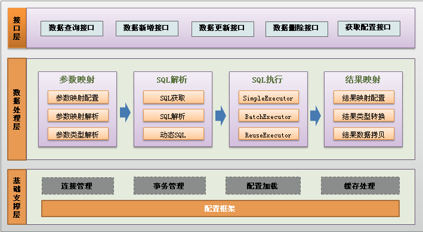

mybatis源码学习
=================
&nbsp;&nbsp;&nbsp;&nbsp;MyBatis 是一款优秀的持久层框架，它支持定制化 SQL、存储过程以及高级映射。MyBatis 避免了几乎所有的 JDBC 代码和手动设置参数以及获取结果集。MyBatis 可以使用简单的 XML 或注解来配置和映射原生信息，将接口和 Java 的 POJOs(Plain Old Java Objects,普通的 Java对象)映射成数据库中的记录。

# 1. 执行流程

&nbsp;&nbsp;&nbsp;&nbsp;MyBatis 执行流程如下图所示，MyBatis应用程序根据XML配置文件创建SqlSessionFactory，SqlSessionFactory在根据配置，配置来源于两个地方，一处是配置文件，一处是Java代码的注解，获取一个SqlSession。SqlSession包含了执行sql所需要的所有方法，可以通过SqlSession实例直接运行映射的sql语句，完成对数据的增删改查和事务提交等，用完之后关闭SqlSession。

## 1.1 Mapper接口

&nbsp;&nbsp;&nbsp;&nbsp;Mapper是MyBatis执行sql使用的，简单使用如下图所示。
~~~java
RuleMapper mapper = session.getMapper(RuleMapper.class);
List<Rule> rules = mapper.selectAllRules();
~~~

&nbsp;&nbsp;&nbsp;&nbsp;Mapper一般提供一些sql执行的接口，不带有具体实现，通过代理实现逻辑。执行Mapper方法会进入invoke调用中，其他包括三个分支：1）若Mapper调用Object的原生方法，那么会走第一个分支；2）若Mapper执行的是接口的默认方法（jdk8+），那么会走第二个分支；3）执行Mapper中定义的sql接口，会走第三个分支。
~~~java
@Override
  public Object invoke(Object proxy, Method method, Object[] args) throws Throwable {
    try {
      if (Object.class.equals(method.getDeclaringClass())) {
        return method.invoke(this, args);
      } else if (isDefaultMethod(method)) {
        return invokeDefaultMethod(proxy, method, args);
      }
    } catch (Throwable t) {
      throw ExceptionUtil.unwrapThrowable(t);
    }
    final MapperMethod mapperMethod = cachedMapperMethod(method);
    return mapperMethod.execute(sqlSession, args);
  }
~~~

&nbsp;&nbsp;&nbsp;&nbsp;具体执行sql逻辑走第三条分支，上述selectAllRules即走第三个分支，执行逻辑是通过MapperMethod完成。
~~~java
public Object execute(SqlSession sqlSession, Object[] args) {
    Object result;
    switch (command.getType()) {
      case INSERT: {
      Object param = method.convertArgsToSqlCommandParam(args);
        result = rowCountResult(sqlSession.insert(command.getName(), param));
        break;
      }
      case UPDATE: {
        Object param = method.convertArgsToSqlCommandParam(args);
        result = rowCountResult(sqlSession.update(command.getName(), param));
        break;
      }
      case DELETE: {
        Object param = method.convertArgsToSqlCommandParam(args);
        result = rowCountResult(sqlSession.delete(command.getName(), param));
        break;
      }
      case SELECT:
        if (method.returnsVoid() && method.hasResultHandler()) {
          executeWithResultHandler(sqlSession, args);
          result = null;
        } else if (method.returnsMany()) {
          result = executeForMany(sqlSession, args);
        } else if (method.returnsMap()) {
          result = executeForMap(sqlSession, args);
        } else if (method.returnsCursor()) {
          result = executeForCursor(sqlSession, args);
        } else {
          Object param = method.convertArgsToSqlCommandParam(args);
          result = sqlSession.selectOne(command.getName(), param);
        }
        break;
      case FLUSH:
        result = sqlSession.flushStatements();
        break;
      default:
        throw new BindingException("Unknown execution method for: " + command.getName());
    }
    if (result == null && method.getReturnType().isPrimitive() && !method.returnsVoid()) {
      throw new BindingException("Mapper method '" + command.getName() 
          + " attempted to return null from a method with a primitive return type (" + method.getReturnType() + ").");
    }
    return result;
  }
~~~