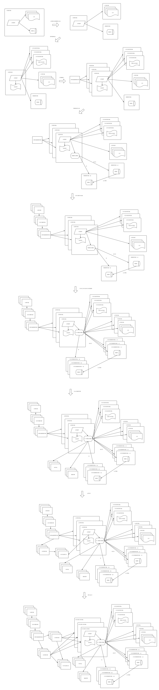

大型网站技术架构核心原理与案例分析
=================

# 1. 大型网站架构演化

# 2. 网站架构模式

- 1 分层

- 2 拆分

- 3 分布式

&nbsp;&nbsp;&nbsp;&nbsp;1)分布式应用和服务；

&nbsp;&nbsp;&nbsp;&nbsp;2）分布式静态资源；

&nbsp;&nbsp;&nbsp;&nbsp;3）分布式数据和存储；

&nbsp;&nbsp;&nbsp;&nbsp;4）分布式计算。

- 4 集群

- 5 缓存

&nbsp;&nbsp;&nbsp;&nbsp;1）CDN；

&nbsp;&nbsp;&nbsp;&nbsp;2）反向代理缓存；

&nbsp;&nbsp;&nbsp;&nbsp;3）本地缓存；

&nbsp;&nbsp;&nbsp;&nbsp;4）分布式缓存。

- 6 异步

&nbsp;&nbsp;&nbsp;&nbsp;异步架构是典型的生产者消费者模式：1）提高系统可用性；2）加快网站响应速度；3）消除并发访问高峰。

- 7 冗余

&nbsp;&nbsp;&nbsp;&nbsp;1）集群；2）数据库定期备份存档（冷备）、读写分离主从备份（热备）、灾备中心搭建。

- 8 自动化

&nbsp;&nbsp;&nbsp;&nbsp;1）发布过程自动化；

&nbsp;&nbsp;&nbsp;&nbsp;2）自动化代码管理；

&nbsp;&nbsp;&nbsp;&nbsp;3）自动化测试；

&nbsp;&nbsp;&nbsp;&nbsp;4）自动化安全检测；

&nbsp;&nbsp;&nbsp;&nbsp;5）自动化部署；

&nbsp;&nbsp;&nbsp;&nbsp;6）自动化监控；

&nbsp;&nbsp;&nbsp;&nbsp;7）自动化报警；

&nbsp;&nbsp;&nbsp;&nbsp;8）自动化失效转移、自动化失效恢复；

&nbsp;&nbsp;&nbsp;&nbsp;9）自动化降级；

&nbsp;&nbsp;&nbsp;&nbsp;10）自动化分配资源。

- 9 安全

# 3. 网站核心架构要素

- 1 性能

- 2 可用性

- 3 伸缩性

- 4 可扩展性

- 5 安全性

# 4. 网站的高性能架构

## 4.1 网站性能测试

&nbsp;&nbsp;&nbsp;&nbsp;视角：1）用户视角的网站性能；（体验）2）开发人员视角的网站性能；（应用程序本身及相关系统的性能，包括响应延迟、系统吞吐量、并发处理能力、系统稳定性等）3）运维人员视角的网站性能。（资源利用率）

&nbsp;&nbsp;&nbsp;&nbsp;指标：1）响应事件；2）并发数；（同时处理请求的数量，反应系统负载情况）3）吞吐量；（单位事件处理请求数量，体现整体处理能力，TPS、HPS、QPS）4）性能计算器。（Load、CPU、线程数、磁盘、网络等）

&nbsp;&nbsp;&nbsp;&nbsp;性能测试分类：1）性能测试；（业务预期目标内，对系统不断施压，验证系统在资源可接受范围内，是否达到性能预期）2）负载测试；（超过预期目标，不断施压，直到系统饱和）3）压力测试；（超过系统饱和，不断施压，直到系统宕机或者不能再处理任何请求）4）稳定性测试。（特定资源情况下，给系统加载一定的业务量，使系统运行较长一段时间，检测系统是否稳定）

## 4.2 前端性能优化

- 1 浏览器访问优化

&nbsp;&nbsp;&nbsp;&nbsp;1）减少HTTP请求；（合并CSS、合并JS、合并图片）2）使用浏览器缓存；3）启用压缩；4）CSS放在页面前面，JS放置再页面后面；5）减少COOKIE传输。

- 2 CDN加速

&nbsp;&nbsp;&nbsp;&nbsp;缓存静态资源，如图片、文件、CSS、JS脚本、静态网页等，将其设置再网站访问第一跳，离用户最近的地方。

- 3 反向代理

&nbsp;&nbsp;&nbsp;&nbsp;1）保护网站安全作用，建立一个安全屏障；2）缓存静态资源；3）缓存动态内容（业务允许不需要实时的动态内容，通过通知机制/定时刷新机制使反向代理缓存失效或更新）。

## 4.3 应用服务器性能优化

- 1 分布式缓存

&nbsp;&nbsp;&nbsp;&nbsp;28原则。

&nbsp;&nbsp;&nbsp;&nbsp;网站性能优化第一定律：优先考虑使用缓存优化功能。

&nbsp;&nbsp;&nbsp;&nbsp;不合理使用缓存：1）频繁修改的数据；2）没有热点的访问数据；3）数据需要强一致的场景；4）缓存丢失会导致业务问题或性能问题的场景。

&nbsp;&nbsp;&nbsp;&nbsp;缓存预热：缓存系统启动时就把热点数据加载号，缓存预加载手段叫做预热。

&nbsp;&nbsp;&nbsp;&nbsp;缓存穿透：不恰当的业务、或者恶意攻击导致持续性高并发地请求某个不存在的缓存数据，缓存数据本身又不存在，所有请求都会落到数据库，导致数据库压力很大甚至崩溃，这样的问题叫做缓存穿透，解决的方式是缓存空对象。

&nbsp;&nbsp;&nbsp;&nbsp;分布式缓存架构：1）需要更新同步的分布式缓存；（所有缓存服务器保存相同副本，更新或者失效缓存代价巨大）2）不互相通讯的分布式缓存。（将缓存离散到不通缓存服务器上面，一致性HASH路由算法，缓存服务器间不通讯，方便扩展，具有良好的伸缩性）

- 2 消息异步化

&nbsp;&nbsp;&nbsp;&nbsp;数据写入消息后立即返回给用户，数据再后续的业务校验、写数据库等操作可能失败，因此使用消息异步化时候，需要适当修改业务流程进行配合，以免产生纠纷。

&nbsp;&nbsp;&nbsp;&nbsp;网站优化原则：任何可以晚点做的事情都应该晚点再做。

- 3 使用集群

&nbsp;&nbsp;&nbsp;&nbsp;使用负载均衡技术为一个应用构建一个由堕胎服务器组成的服务集群，将并发请求分发到堕胎服务器上面操作，避免单机负载压力过大导致响应缓慢。

- 4 代码优化

&nbsp;&nbsp;&nbsp;&nbsp;1）多线程，原因是IO阻塞与多CPU，需要解决线程安全相关的问题；2）资源复用，池化技术；（数据库连接池、通讯长连接、线程池、复杂对象池）3）合理数据结构；4）垃圾回收。

- 5 存储性能优化

&nbsp;&nbsp;&nbsp;&nbsp;1）机械磁盘与固态硬盘；2）B+树（针对磁盘存储而优化的N叉排序树）与LSM树（N阶合并树）；3）RAID与HDFS（分布式文件系统）。

# 5. 网站的高可用架构

## 5.1 高可用应用

- 1 负载均衡进行无状态服务的失效转移

- 2 应用服务器集群的Session管理

&nbsp;&nbsp;&nbsp;&nbsp;1）Session复制；2）Session绑定；3）利用Cookie记录Session；4）Session服务器。

## 5.2 高可用服务

- 1 负载均衡进行失效转移

- 2 分级管理

&nbsp;&nbsp;&nbsp;&nbsp;核心应用和服务使用较好的硬件，服务部署上面采取隔离，避免故障的连锁反应。

- 3 超时设置

- 4 异步调用

- 5 服务降级

&nbsp;&nbsp;&nbsp;&nbsp;1）拒绝服务：拒绝低优先级应用的调用，减少服务调用并发数，确保核心应用服务调用；2）关闭功能：关闭部分不重要的服务，或者服务内部关闭部分不重要的功能。

- 6 幂等性设计

## 5.3 高可用的数据

&nbsp;&nbsp;&nbsp;&nbsp;不同于高可用的应用和数据，由于数据存储服务器保存数据不通，服务宕极后，数据访问请求不能随意切换到集群中的其他机器上面。

&nbsp;&nbsp;&nbsp;&nbsp;保存数据存储高可用的手段主要是数据备份和失效转移机制。数据备份保存数据多个副本，失效转移机制保证当一个数据副本不可访问时，可以切换到数据其他副本。

- 1 CAP原理

&nbsp;&nbsp;&nbsp;&nbsp;C（Consistency 数据一致性）、A（Availability 数据可用性）、P（Partition Tolerance 分区耐受性），CAP原理认为，一个提供数据服务的存储系统无法同时满足三个条件，通常会强化分布式存储系统的可用性和伸缩性，即满足AP，某种程度上面牺牲C。

&nbsp;&nbsp;&nbsp;&nbsp;数据一致性分为：1）数据强一致：数据在多个副本服务存储中一致；2）数据用户一致：数据在物理存储各个副本数据可能不一致，但是终端用户访问时，通过纠错和校验机制，可以确定一个一致且正确的数据；3）数据最终一致：数据一致性较弱的场景，物理存储的数据可能不一致，终端用户访问的也可能不一致，但是经过一段时间的自我恢复和修正，最终数据会达到一致。

- 2 数据备份

&nbsp;&nbsp;&nbsp;&nbsp;1）数据备份最简单的方案是冷备，优点是简单和廉价，成本和技术难度较低。缺点是不能保证数据最终一致，数据是定期复制，因此备份数据陈旧，如果系统数据丢失，从某个备份节点开始后的更新数据就会永远丢失，同时不能保证数据可用性，从冷备恢复数据需要较长时间，这段时间系统不可用。

&nbsp;&nbsp;&nbsp;&nbsp;2）数据热备分为两种：异步热备方式和同步热备方式。

- 3 失效转移

&nbsp;&nbsp;&nbsp;&nbsp;失效转移操作分为三部：1）失效确认：判断系统是否宕机的手段通常两种，心跳检测和应用程序访问失败报告；2）访问转移；3）数据恢复。

## 5.4 网站软件质量保证

# 6 网站的伸缩性架构

## 6.1 网站架构的伸缩性

- 1 不同功能进行物理分离

&nbsp;&nbsp;&nbsp;&nbsp;1）纵向分离（分层后分离）：将业务处理流程上的不同部分分离部署；2）横向分离（业务分割后分离）：将不同业务模块分离部署。

- 2 单一功能通过集群规模

&nbsp;&nbsp;&nbsp;&nbsp;1）应用服务器集群；2）数据服务器集群。

## 6.2 应用服务器集群的伸缩性

- 1 HTTP重定向负载均衡

&nbsp;&nbsp;&nbsp;&nbsp;优点：简单比较好实现。缺点：浏览器需要两次请求才能完成一次访问，性能较差；搜索引擎可能判断为SEO作弊，降低搜索排名。

- 2 DNS域名解析负载

&nbsp;&nbsp;&nbsp;&nbsp;优点：将负载均衡工作转交给DNS，省去维护负载的麻烦，同时许多DNS还支持基于地理位置的域名解析，即会将域名解析为较近的服务器地址，加快用户访问，改善性能。缺点：DNS多级解析，每一级DNS都可能缓存，当某台服务器下线后，不能及时生效，DNS负载均衡控制权在域名服务商那里，无法做更多改善和更强大的管理。

&nbsp;&nbsp;&nbsp;&nbsp;大型网站总是部分使用DNS域名解析，利用域名解析作为第一级负载均衡手段，即域名解析得到的一组服务器并不是实际提供服务的服务服务器，而是同样提供负载均衡服务的内部服务器，这组内部负载均衡服务器再进行负载均衡，将请求分发到真实的服务器上面。

- 3 反向代理负载均衡

&nbsp;&nbsp;&nbsp;&nbsp;反向代理服务器转发请求再HTTP协议层面，应用层负载均衡。优点和反向代理服务器功能集成在一起，部署简单。缺点是反向代理服务器是所有请求和响应的中转站，性能可能会称为瓶颈。

- 4 IP负载均衡

&nbsp;&nbsp;&nbsp;&nbsp;网络层通过修改请求目标地址进行负载均衡的技术。

- 5 数据链路层负载均衡

&nbsp;&nbsp;&nbsp;&nbsp;数据传输方式称为三角传输模式，负载均衡数据分发过程中不修改IP地址，只修改目标mac地址，通过配置真实物理服务器集群所有机器虚拟IP和负载均衡服务器IP地址一致，从而达到不修改数据包源地址和目标地址就可以进行数据分发。

&nbsp;&nbsp;&nbsp;&nbsp;LVS目前就是数据链路层负载均衡。性能比较高，不需要通过负载均衡服务器进行地址转换，可以将响应数据包直接返回给用户，避免负载均衡服务器网卡带宽成为瓶颈。这种负载均衡方式称为直接路由方式（DR）。

- 6 负载均衡算法

&nbsp;&nbsp;&nbsp;&nbsp;1）轮询；2）加权轮询；3）随机；4）最少连接；5）源地址散列（请求来源IP地址散列，同一个IP地址请求到达同一个服务器上面，实现会话粘连）。

## 6.3 分布式缓存集群伸缩性

- 1 一致性HASH算法

&nbsp;&nbsp;&nbsp;&nbsp;“虚拟层”解决集群机器变更缓存命中率低的问题，虚拟节点越多，缓存命中率影响越低，负载均衡余越均匀，虚拟节点多会影响性能，经验值150。

## 6.4 数据存储服务集群伸缩性

&nbsp;&nbsp;&nbsp;&nbsp;数据存储服务器集群的伸缩性对数据持久性和可用性要求更高，必须保证数据的可靠存储，任何情况都需要保证数据的可用性和正确性。

- 1 关系数据库集群伸缩性

&nbsp;&nbsp;&nbsp;&nbsp;1）独写分离架构，写必须写主库；2）业务分割模式，即数据分库。
